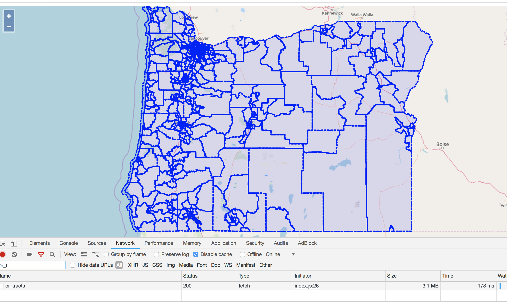

## Example GeoBuf

This example uses [mapbox/geobuf](https://github.com/mapbox/geobuf), a compact binary encoding for geographic data to serve and consume GeoJSON data in [protocol buffers](https://developers.google.com/protocol-buffers/).

The purpose of this example is to illustrate how large datasets can be efficiently compacted and served over HTTP.  

The original dataset I am using is a `15 MB` shapefile representing Oregon census tracts [available here](ftp://ftp2.census.gov/geo/pvs/tiger2010st/41_Oregon/41/).  When converted to GeoJSON, the file is `26.7 MB` in size.  Converting to a `protocol buffer` brings the size down to `3.3 MB`.  When compressed through `gzip`, the resulting file size is `3.1 MB`.

## Running this example

There are two components, a simple express server to serve out the file (in the server folder) and a simple client app built with OpenLayers.

To start the server (running on port `3000`):

```bash
$ cd server
$ npm install
$ node server.js
```

To bundle and run the client app (new tab in terminal):

```bash
$ cd client
$ npm install
$ npm start
```

Then navigate to [http://localhost:1234/](http://localhost:1234/)


